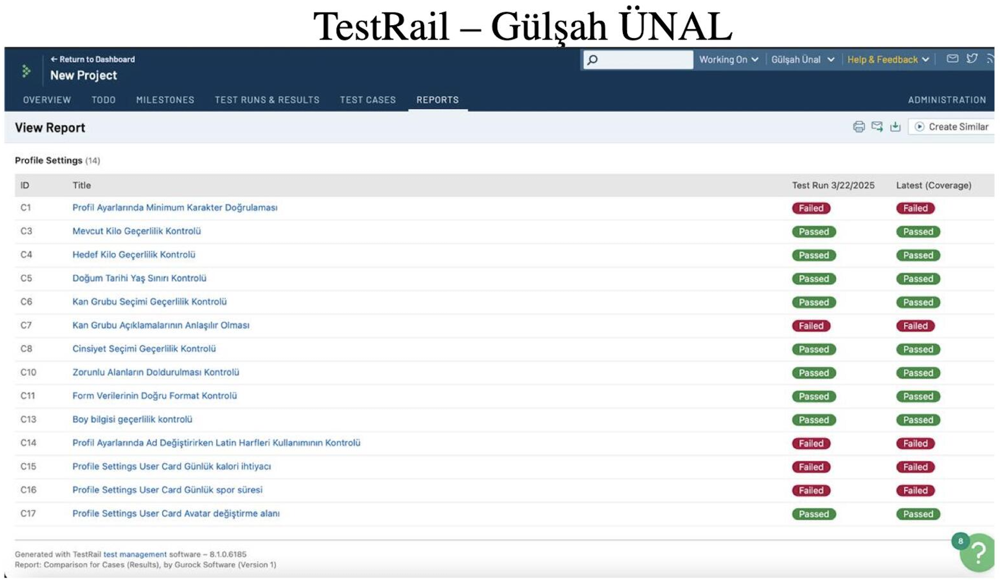

# Power Puls Test Execution

This repository contains the English test execution documentation prepared from the available TestRail results for the **Power Puls** application.

## Objective

This report provides a comprehensive overview of the test execution activities conducted for the Power Puls application. It covers the testing of key functionalities and modules executed in this cycle and evaluates the application's stability and readiness for the upcoming release.

## Test Evidence

The screenshot below captures the TestRail execution overview used as source evidence for this documentation.

## Scope Covered

The executed test set focuses on the **Profile Settings** area, including:

- Input validation for profile fields (minimum characters, required fields, and correct format)
- Health metric validation (current weight, target weight, and height)
- Personal information controls (birth date age limit, blood group, and gender)
- User card features (daily calorie need, daily sports duration, and avatar update area)

## Execution Snapshot

- Test run date: **2025-03-22**
- Total test cases: **14**
- Passed: **9**
- Failed: **5**
- Pass rate: **64.29%**

## Repository Structure

- `reports/test-execution-report.md`: Detailed execution report
- `data/test-cases-results.csv`: Test case level results in CSV format
- `data/test-summary.json`: Summary metrics in JSON format
- `assets/images/testrail-profile-settings-overview.png`: TestRail execution screenshot

## Release Readiness (Current)

Based on the current failure count and affected areas, this build is **not yet release-ready**.

Critical and functional failures in profile validation and user card calculations should be fixed and re-tested before production deployment.
