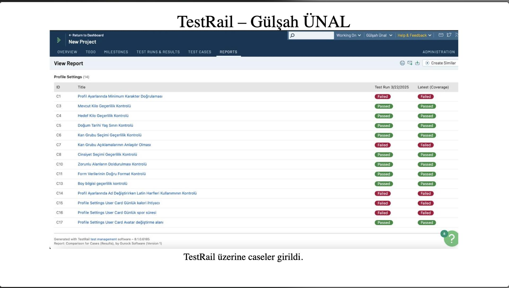

# Test Execution Report - Power Puls

## 1. Executive Summary

This report provides a comprehensive overview of the test execution activities conducted for the Power Puls application. It encompasses testing of key functionalities in the Profile Settings module, including profile input validation, biometric data validation, personal information controls, and user card behavior. The objective is to assess application stability and readiness for the upcoming release.

Execution results indicate that core flows are partially stable, but several functional and validation issues remain. Out of 14 executed test cases, 5 failed.

## 2. Test Scope

### In Scope

- Profile settings input rules
- Required field behavior
- Format and character constraints
- Biometric input validation (current weight, target weight, height)
- Birth date and age-limit checks
- Blood group and gender selection controls
- User card calculations and UI fields

### Out of Scope

- Authentication and authorization
- Payment or subscription flows
- Performance and load testing
- Security penetration testing
- Cross-browser and accessibility deep validation

## 3. Test Environment

- Test management tool: TestRail
- Test run date: 2025-03-22
- Module under test: Profile Settings
- Platform details: Not provided in source data

### Evidence

The screenshot below captures the TestRail results referenced in this report.

## 4. Execution Results

| ID  | Test Case | Result |
|-----|-----------|--------|
| C1  | Minimum character validation in profile settings | Failed |
| C3  | Current weight validity check | Passed |
| C4  | Target weight validity check | Passed |
| C5  | Birth date age limit check | Passed |
| C6  | Blood group selection validity check | Passed |
| C7  | Blood group descriptions clarity | Failed |
| C8  | Gender selection validity check | Passed |
| C10 | Required fields completion check | Passed |
| C11 | Form data format validation | Passed |
| C13 | Height information validity check | Passed |
| C14 | Latin characters enforcement while changing name | Failed |
| C15 | User card daily calorie requirement | Failed |
| C16 | User card daily sports duration | Failed |
| C17 | User card avatar change area | Passed |

## 5. Metrics

- Total executed: 14
- Passed: 9
- Failed: 5
- Blocked: 0
- Not run: 0
- Pass rate: 64.29%
- Fail rate: 35.71%

## 6. Defect Impact Analysis

### High Impact

- C15: Daily calorie requirement on user card
- C16: Daily sports duration on user card

These failures affect core personalized fitness guidance and can reduce user trust in generated recommendations.

### Medium Impact

- C1: Minimum character validation
- C14: Latin character enforcement for name updates

These issues may allow invalid profile data and cause data integrity problems.

### Low to Medium Impact

- C7: Blood group descriptions clarity

This issue impacts user understanding and usability but may not directly block core flows.

## 7. Release Readiness Assessment

Current status: **Not Ready for Release**

The application demonstrates partial stability in profile forms, but failed validations and incorrect user card outcomes indicate functional quality gaps. A release should be gated until these defects are fixed and verified.

## 8. Recommendations

1. Prioritize fixes for C15 and C16 due to functional correctness impact.
2. Resolve input validation gaps in C1 and C14 to protect data quality.
3. Improve copy/content logic for C7 to ensure clear health-related selections.
4. Run a focused regression on Profile Settings after fixes.
5. Execute one additional full validation cycle before release approval.

## 9. Conclusion

The test cycle identified important defects in validation and profile-driven calculation features. While many baseline validations pass, unresolved failures materially impact reliability. The next release decision should be made only after corrective actions and successful re-test evidence.
